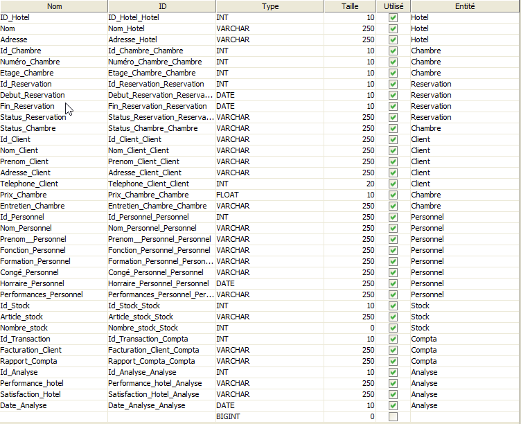
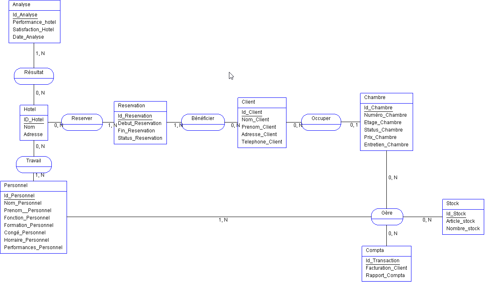
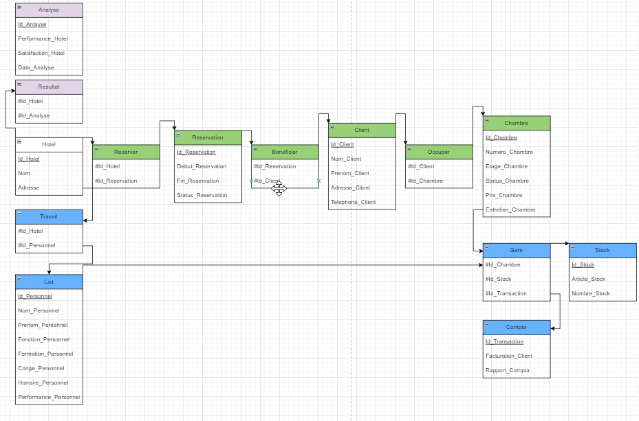
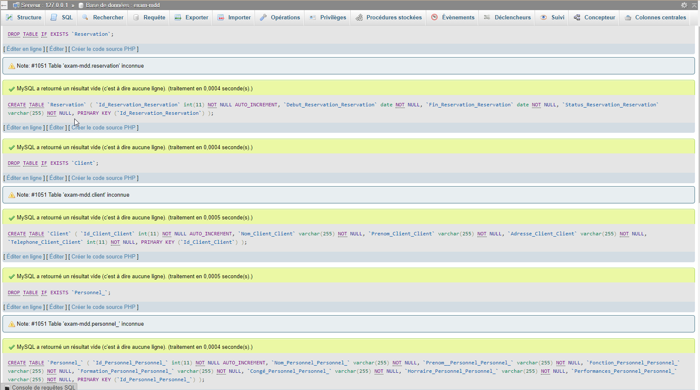
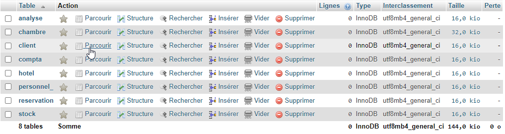

#  Examen MDD Virgile 

## Dictionnaire de données



## MCD 



## MLD



## MPD

**Shéma Relationel**
Hotel (ID_Hotel_Hotel, Nom_Hotel, Adresse_Hotel)  
Chambre (Id_Chambre_Chambre, Numéro_Chambre_Chambre, Etage_Chambre_Chambre, Status_Chambre_Chambre, Prix_Chambre_Chambre, Entretien_Chambre_Chambre, #client_id_client_client)  
Reservation (Id_Reservation_Reservation, Debut_Reservation_Reservation, Fin_Reservation_Reservation, Status_Reservation_Reservation) 
Client (Id_Client_Client, Nom_Client_Client, Prenom_Client_Client, Adresse_Client_Client, Telephone_Client_Client)  
Personnel_ (Id_Personnel_Personnel_, Nom_Personnel_Personnel_, Prenom__Personnel_Personnel_, Fonction_Personnel_Personnel_, Formation_Personnel_Personnel_, Congé_Personnel_Personnel_, Horraire_Personnel_Personnel_, Performances_Personnel_Personnel_)  
Stock (Id_Stock_Stock, Article_stock_Stock, Nombre_stock_Stock)  
Compta (Id_Transaction_Compta, Facturation_Client_Compta, Rapport_Compta_Compta)  
Analyse (Id_Analyse_Analyse, Performance_hotel_Analyse, Satisfaction_Hotel_Analyse, Date_Analyse_Analyse)  Reserver (ID_Hotel_Hotel, Id_Reservation_Reservation)  
Bénéficier (Id_Reservation_Reservation, Id_Client_Client)  
Travail (ID_Hotel_Hotel, Id_Personnel_Personnel_)  Gère (Id_Personnel_Personnel_, Id_Stock_Stock, Id_Chambre_Chambre, Id_Transaction_Compta)  
Résultat (Id_Analyse_Analyse, ID_Hotel_Hotel)  

**Script SQL**

```sql
DROP TABLE IF EXISTS `Hotel`;
CREATE TABLE `Hotel` (
  `ID_Hotel_Hotel` int(11) NOT NULL AUTO_INCREMENT,
  `Nom_Hotel` varchar(255) NOT NULL,
  `Adresse_Hotel` varchar(255) NOT NULL,
  PRIMARY KEY (`ID_Hotel_Hotel`)
);

DROP TABLE IF EXISTS `Chambre`;
CREATE TABLE `Chambre` (
  `Id_Chambre_Chambre` int(11) NOT NULL AUTO_INCREMENT,
  `Numéro_Chambre_Chambre` int(11) NOT NULL,
  `Etage_Chambre_Chambre` int(11) NOT NULL,
  `Status_Chambre_Chambre` varchar(255) NOT NULL,
  `Prix_Chambre_Chambre` int(11) NOT NULL,
  `Entretien_Chambre_Chambre` varchar(255) NOT NULL,
  `#client_id_client_client` int(11) NOT NULL,
  PRIMARY KEY (`Id_Chambre_Chambre`),
  KEY `#client_id_client_client` (`#client_id_client_client`),
  CONSTRAINT `Chambre_ibfk_1` FOREIGN KEY (`#client_id_client_client`) REFERENCES `Client` (`Id_Client_Client`)
);

DROP TABLE IF EXISTS `Reservation`;
CREATE TABLE `Reservation` (
  `Id_Reservation_Reservation` int(11) NOT NULL AUTO_INCREMENT,
  `Debut_Reservation_Reservation` date NOT NULL,
  `Fin_Reservation_Reservation` date NOT NULL,
  `Status_Reservation_Reservation` varchar(255) NOT NULL,
  PRIMARY KEY (`Id_Reservation_Reservation`)
);

DROP TABLE IF EXISTS `Client`;
CREATE TABLE `Client` (
  `Id_Client_Client` int(11) NOT NULL AUTO_INCREMENT,
  `Nom_Client_Client` varchar(255) NOT NULL,
  `Prenom_Client_Client` varchar(255) NOT NULL,
  `Adresse_Client_Client` varchar(255) NOT NULL,
  `Telephone_Client_Client` int(11) NOT NULL,
  PRIMARY KEY (`Id_Client_Client`)
);

DROP TABLE IF EXISTS `Personnel_`;
CREATE TABLE `Personnel_` (
  `Id_Personnel_Personnel_` int(11) NOT NULL AUTO_INCREMENT,
  `Nom_Personnel_Personnel_` varchar(255) NOT NULL,
  `Prenom__Personnel_Personnel_` varchar(255) NOT NULL,
  `Fonction_Personnel_Personnel_` varchar(255) NOT NULL,
  `Formation_Personnel_Personnel_` varchar(255) NOT NULL,
  `Congé_Personnel_Personnel_` varchar(255) NOT NULL,
  `Horraire_Personnel_Personnel_` varchar(255) NOT NULL,
  `Performances_Personnel_Personnel_` varchar(255) NOT NULL,
  PRIMARY KEY (`Id_Personnel_Personnel_`)
);

DROP TABLE IF EXISTS `Stock`;
CREATE TABLE `Stock` (
  `Id_Stock_Stock` int(11) NOT NULL AUTO_INCREMENT,
  `Article_stock_Stock` varchar(255) NOT NULL,
  `Nombre_stock_Stock` int(11) NOT NULL,
  PRIMARY KEY (`Id_Stock_Stock`)
);

DROP TABLE IF EXISTS `Compta`;
CREATE TABLE `Compta` (
  `Id_Transaction_Compta` int(11) NOT NULL AUTO_INCREMENT,
  `Facturation_Client_Compta` varchar(255) NOT NULL,
  `Rapport_Compta_Compta` varchar(255) NOT NULL,
  PRIMARY KEY (`Id_Transaction_Compta`)
);

DROP TABLE IF EXISTS `Analyse`;
CREATE TABLE `Analyse` (
  `Id_Analyse_Analyse` int(11) NOT NULL AUTO_INCREMENT,
  `Performance_hotel_Analyse` varchar(255) NOT NULL,
  `Satisfaction_Hotel_Analyse` varchar(255) NOT NULL,
  `Date_Analyse_Analyse` date NOT NULL,
  PRIMARY KEY (`Id_Analyse_Analyse`)
);
```

**Resultat de la requete SQL :**





